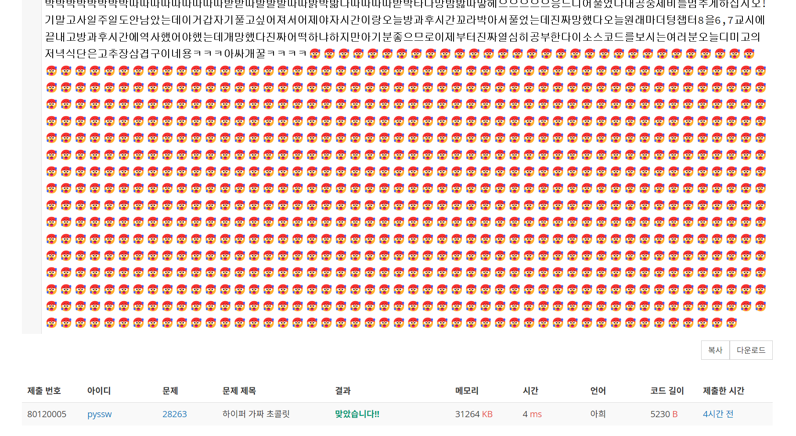

# 하이퍼 가짜 초콜렛[#](https://www.acmicpc.net/problem/28263)

## 문제
초콜릿과 숫자놀이를 좋아하는 코코는 “초콜릿 수”를 다음과 같이 정의하였다.

-   어떤 양의 정수  $n>1$이  $1$과 자기 자신으로만 나누어 떨어질 때,  $n$을 초콜릿 수라고 한다.

얼마 뒤 코코는 “코코 정리”를 발견하였다.

-    $p$가 초콜릿 수이면,  $p$와 서로소인 모든 정수  $a$에 대해  $a^{p-1}\operatorname{mod} p=1$이다.

코코는 이를 이용해 어떤 수가 초콜릿 수인지 판별하는 방법을 떠올렸다. 구체적인 방법은 다음과 같다.

-    $p$와 서로소인 모든 정수  $a$에 대해  $a^{p-1}\operatorname{mod} p=1$이면,  $p$는 초콜릿 수이다.

하지만 얼마 지나지 않아 코코는 561이 이 판별법의 조건을 만족하지만 초콜릿 수가 아니라는 사실을 발견하였다. 코코는 이러한 수를 “가짜 초콜릿 수”라고 부르기로 하고, 가짜 초콜릿 수를 찾는 방법을 연구하기 시작했다.

초콜릿 공장을 돌리는 것도 잊고 연구에 매달린 결과, 코코는 3개, 4개, ..., 10개의 초콜릿 수를 곱한 가짜 초콜릿 수를 찾을 수 있었지만, 11개를 곱한 것은 찾을 수 없었다. 코코 대신 이러한 가짜 초콜릿 수를 찾아주자. 아무거나 찾는 것은 어렵지 않으니, 다음의 조건을 만족하는 수  $N$을 찾아보자.

-    $N=a_1\times a_2\times\cdots\times a_{11}$이라고 쓸 때, $N$은 가짜 초콜릿 수이고, $1\le i\le 11$에 대해  $a_i$는 $10^7\le a_i<10^8$를 만족하는 초콜릿 수이다.

## 문제 정리
+ 초콜릿 수 : 약수를 1과 자신만 가지는 수 = 소수
+ 코코 정리 : 초콜릿 수 $p$에 대해 서로소인 모든 정수 $a$는 $a^{p-1}\equiv1\operatorname{mod} p$ = 페르마 소정리
+ 가짜 초콜릿 수 $N$ : $N$과 서로소인 임의의 수 $a$에 대해 페르마 소정리를 만족시키는 **합성수**

## exploit
::: note[important]
페르마 소정리를 만족시키는 합성수 $N$을 [Carmichael number](https://en.wikipedia.org/wiki/Carmichael_number)라 한다.
$N$은 소수의 곱 꼴 $\prod\limits_{i=0}^kp_i$로 나타낼 수 있고, 
이때 $N$은 [square-free](https://en.wikipedia.org/wiki/Square-free_integer),  $p_i-1\vert N-1$,  $N\equiv1\operatorname{mod}T$를 만족시킨다
::: 

Carmichael number $N$을 생성하는 방법은 다음과 같다;
1. 적당히 큰 합성수 $T$를 생성한다(약수가 많을수록 좋다)
    + 이 문제의 경우 $T=2^83^65^47^2 11$
2. $T$의 모든 약수 $d_k$중, $p=d_k+1$이 소수인 $p$를 골라 집합 $S$를 만든다.
    + 문제에서 $p$의 범위($10^7\leq p<10^8$)까지 고려한다면 $S$는 58개의 후보 $p$가 존재한다.
3. 그냥 $_{53}C_{11}$을 계산하면 $227692286640$가지의 경우가 존재하므로 MITM 알고리즘을 통해 $N=p_1p_2...p_{11}$을 금방 찾을 수 있다.

::: note[WOW!]
먼저, dictionary **five**, **six**를 정의하겠다. $\text{five}[n]=k$는 $\operatorname{mod} T$에서 $k=n^{-1}$라는 의미이다.
$N$을 쪼개어 $d_5,d_6 = p_1p_2p_3p_4p_5, p_6p_7p_8p_9p_{10}p_{11}$의 두 부분으로 생각한다면, 
$$
d_5d_6\equiv1\operatorname{mod}T \implies d_5^{-1}\equiv d_6\operatorname{mod} T
$$
$\text{six}[d_5^{-1}]=d_5, \text{five}[d_6^{-1}]=d_6$을 정의할 수 있다<br>
($\text{five}[d_6^{-1}]=d_6$에서 $d_6^{-1}$은 **모듈러** 역원이므로 원래의 $d_6=N/d_5$보다 작은 값).<br>
따라서, $S$에서 무작위로 원소를 골라 $d_5, d_6$를 정의한다 (각각 무작위이므로 이때 $d_5\not\equiv d_6^{-1}\operatorname{mod}T)$.

각각의 역원을 구한 후 $\text{six}[d_5^{-1}] = \text{six}[d_6] = d_5, \ \text{five}[d_6^{-1}] = \text{five}[d_5] = d_6$에 저장한다. <br>
$d_5, d_6$을 계속 생성하다보면 $\text{five}[d_5]$와 $\text{six}[d_5^{-1}]$이 동시에 존재하는 경우가 발생하게 되고,<br>
이때, $d_5\sdot  \text{five}[d_5]=d_5\sdot d_6=N$이 된다. $N\equiv1\operatorname{mod}T$를 통해 확인 가능하다.
:::
## ex.py
```python
from Crypto.Util.number import isPrime
from sympy import divisors, gcd, prod
from random import sample

n = 2**8 * 3**6 * 5**4 * 7**2 * 11

_n_div = list(divisors(n))
S = []

for div in _n_div:
    div = div + 1
    if isPrime(div) and gcd(div, n) == 1:
        if 10**7 <= div < 10**8:
            S.append(div)

five, six = {}, {}

def find():
    def search():
        while True:
            div = sample(S, 5)
            D = prod(div)

            try: inv = pow(D, -1, n)
            except: continue

            six[inv] = D

            if inv in six and D%n in five:
                return D * five[D%n]

            div = sample(S, 6)
            D = prod(div)

            try: inv = pow(D, -1, n)
            except: continue

            five[inv] = D

            if inv in five and D%n in six:
                return D * six[D%n]

    while True:
        sol = search()
        factors = []
        for s in S:
            if sol % s == 0:
                factors.append(s)

        if len(factors) == 11:
            return factors, sol
        
good, choco = find()

assert all([10**7 <= i < 10**8 for i in good])
assert all([(choco-1)%(i-1)==0 for i in good])
assert choco % n == 1

raise ZeroDivisionError(" ".join(map(str, good)))
```


### 읽어주셔서 감사합니다!<br>
