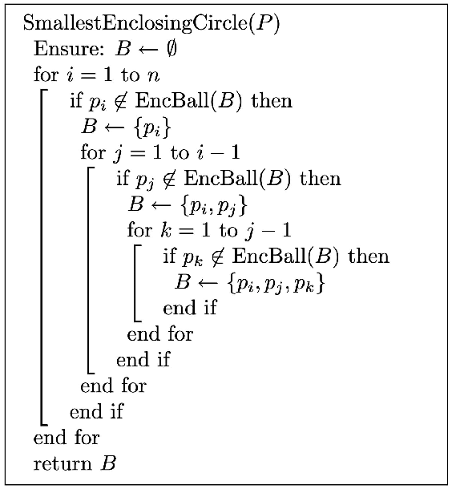

# Intro
[BOJ 14507](https://www.acmicpc.net/problem/14507)

야무진 날먹 기하 문제를 시도해보았다
그리고 풀었다
# 문제

Vera is an astronomer studying locality of nearby star systems. The star systems can be thought of as 3D points in space. Vera would like to place a can around the stars. In other words, she would like to know what is the smallest volume cylinder that encloses the stars. The cylinder can be oriented in any direction. At least one base of the cylinder must have at least three stars.

Each input will consist of a single test case. Note that your program may be run multiple times on different inputs. The first line of input will contain a single integer n (4 ≤ n ≤ 1,000), representing the number of stars.

Each of the next n lines will contain three integers x, y and z (−1,000 ≤ x, y, z ≤ 1,000), representing the position of a single star. No two stars will be at the same position. No four stars will be coplanar.
<br><br><br>
그니까 3차원 공간에 놓여진 별들을 원기둥 안에 담아야 한다. 그리고 원기둥의 부피가 최소가 되도록 한다.

그럼 해결해보도록 하자!
# Solution
1. 볼록 껍질 구하기
+ 가장 바깥 점들을 담는 원기둥은 반드시 안쪽 점들도 담기 때문에 가장 바깥 점들만 고려해도 된다. 이건 볼록 껍질로 구할 수 있다. 3차원 볼록 껍질 구현은 쉽지 않으니 열심히 노력해보자. https://codeforces.com/blog/entry/81768

 + 나는 Incremental Algorithm을 썼다. 더 빠른 알고리즘도 있으나 이거면 충분하다. 또한 어떠한 네 점도 한 평면 위에 있지 않으니 힘든 구현이 필요 없다.
 + 볼록 껍질을 구했으면 세 점으로 이루어진 평면들로 이루어진 다면체가 나올 것이다. 원기둥의 적어도 하나의 밑면에는 세 점이 있어야 하므로, 밑면이 다면체의 어떤 한 면을 포함하면 된다. 그리고 모든 면에 대해 시도해보면 최소 부피가 나올 것이다.
 
 2. 밑면 구하기
 + 다면체의 어떤 한 면을 아주 큰 평면이라고 생각해보자. 그럼 이 평면은 면의 세 꼭짓점으로 이루어진 평면이 될 것이다.
 + 이제 모든 점을 이 평면에 투영한다. 점이 평면에 수직인 방향으로 이동하여 평면 위에 놓일 것이다. 좀 더 자세히 알아보자
	 + 평면 $S$가 세 점 $A, B, C$로 이루어져 있을 때, $S$의 법선 벡터 $\overrightarrow{n}=\overrightarrow{AB}\ \times\ \overrightarrow{AC}$ 이다. 이 법선 벡터를 단위 벡터로 만들어 버리자. 그러면 단위 벡터 $\overrightarrow{u}={\overrightarrow{n} \over ||\overrightarrow{n}||}$ 이다. 이제 어떤 점 $P$를 이 점에 투영한다는 것은 $\overrightarrow{n}$의 반대 방향으로 $P$와 $S$의 거리만큼 이동하는 것과 같다. 이때 $P$와 $S$ 사이의 거리 $x=(\overrightarrow{P}-\overrightarrow{A})\sdot\overrightarrow{u}$이다. 그럼 투영한 점 $P'=P-x\overrightarrow{u}$ 이다. 이걸 모든 점에 대해 반복하면서 투영한 점의 집합을 구하고 동시에 $|x|$의 최댓값, 즉 원기둥의 높이도 구할 수 있다. 참고로 $x$는 부호가 있는 거리이므로 높이를 구할 땐 절댓값을 붙인다.
+ 이제 밑면을 구해보자. 평면 위에 점들을 투영했으니 이 점들의 최소 외접원을 구하면 그것이 원기둥의 밑면이 된다. 최소 외접원 알고리즘을 사용하자 
  (짧길래 그냥 이거 썼다)
 
 3. 부피 구하기
 + 위 과정에서 밑면의 반지름, 높이까지 구할 수 있으니 모든 면에 대해 반복하면서 부피의 최솟값을 구하자.
# Code
코드가 상당히 더럽다;
```python
import sys
from random import shuffle
input = sys.stdin.readline
class pt3:
    def __init__(self,x,y,z):
        self.x = x
        self.y = y
        self.z = z
    def __sub__(self, other):
        return pt3(self.x - other.x, self.y - other.y, self.z - other.z)
    def __add__(s,o):
        return pt3(s.x+o.x,s.y+o.y,s.z+o.z)
    def __mul__(s,o):
        return pt3(s.x*o,s.y*o,s.z*o)
    def cross(self,other):
        cross_x = self.y * other.z - self.z * other.y
        cross_y = self.z * other.x - self.x * other.z
        cross_z = self.x * other.y - self.y * other.x
        return pt3(cross_x,cross_y,cross_z)
    def dot(self,other):
        return self.x*other.x + self.y*other.y + self.z*other.z
    def norm(s):
        return (s.x**2+s.y**2+s.z**2)**.5
class face:
    def __init__(self, a, b, c, q):
        self.a = a
        self.b = b
        self.c = c
        self.q = q
def convex3(p):
    n = len(p)
    f = []
    dead = [[True for _ in range(n)] for _ in range(n)]
    def add_face(a,b,c):
        f.append(face(a, b, c, (p[b] - p[a]).cross(p[c] - p[a])))
        dead[a][b] = dead[b][c] = dead[c][a] = False
    add_face(0, 1, 2)
    add_face(0, 2, 1)
    for i in range(3, n):
        f2 = []
        for F in f:
            if (p[i] - p[F.a]).dot(F.q) > 0:
                dead[F.a][F.b] = dead[F.b][F.c] = dead[F.c][F.a] = True
            else:
                f2.append(F)
        f.clear()
        for F in f2:
            arr = [F.a, F.b, F.c]
            for j in range(3):
                a, b = arr[j], arr[(j + 1) % 3]
                if dead[b][a]:
                    add_face(b, a, i)
        f.extend(f2)
    return f
def det33(matrix):
    return matrix[0][0] * (matrix[1][1] * matrix[2][2] - matrix[1][2] * matrix[2][1])-matrix[0][1] * (matrix[1][0] * matrix[2][2] - matrix[1][2] * matrix[2][0])+matrix[0][2] * (matrix[1][0] * matrix[2][1] - matrix[1][1] * matrix[2][0])
def iscoplanar(a,b,c,d):
    ab = b-a
    ac = c-a
    ad = d-a
    return det33([[ab.x,ab.y,ab.z],[ac.x,ac.y,ac.z],[ad.x,ad.y,ad.z]]) == 0
def circumcenter(a, b, c):
    x = c-a
    y = b-a
    s1 = x.norm(); s2 = y.norm()
    c = x.cross(y); d = c*-1; e = 2*(c.norm()**2)
    p = d.cross(y); q = c.cross(x)
    return pt3(a.x+s1*s1/e*p.x+s2*s2/e*q.x , a.y+s1*s1/e*p.y+s2*s2/e*q.y, a.z+s1*s1/e*p.z+s2*s2/e*q.z)
def ses(P):
    C = P[0]
    r = 0
    eps = 1+1e-9
    for i in range(len(P)):
        if (P[i]-C).norm() <= r*eps:
            continue
        C = P[i]
        r = 0
        for j in range(i):
            if (P[j]-C).norm() <= r*eps:
                continue
            C = (P[i]+P[j])*.5
            r = (C-P[i]).norm()
            for k in range(j):
                if (P[k]-C).norm() <= r*eps:
                    continue
                C = circumcenter(P[i],P[j],P[k])
                r = (C-P[i]).norm()
    return r
n = int(input())
P = []
for _ in range(n):
    P.append(pt3(*map(int,input().split())))
while iscoplanar(P[0],P[1],P[2],P[3]):
    shuffle(P)
result = convex3(P)
ans = float('inf')
for plane in result:
    projlst = []
    X = 0
    u = plane.q*(1/plane.q.norm())
    for p in P:
        x = (p-P[plane.a]).dot(u)
        X = max(X,abs(x))
        projlst.append(p-u*x)
    r = ses(projlst)
    ans = min(ans,(r**2)*X)
print(ans*3.1415926535)
```
<br><br><br>
Well Done
